# Codebase Overview

This is a **RAG (Retrieval-Augmented Generation) Chatbot** for course materials - a full-stack application that lets users query course content and get AI-powered answers.

## Architecture

**Client-Server Setup:**
- **Frontend**: Static HTML/CSS/JS with a chat interface
- **Backend**: Python FastAPI server with RAG logic
- **Vector DB**: ChromaDB for semantic search
- **AI**: Claude API with tool-calling capabilities

## Technology Stack

**Backend:**
- FastAPI + Uvicorn (web server)
- ChromaDB (vector database)
- Sentence Transformers (`all-MiniLM-L6-v2` for embeddings)
- Anthropic SDK (Claude integration)
- Pydantic (data validation)

**Frontend:**
- Vanilla JavaScript (ES6+)
- Marked.js (markdown rendering)
- CSS3 with modern layouts

## Directory Structure

```
starting-ragchatbot-codebase/
├── backend/              # Python FastAPI app
│   ├── app.py           # Main entry, routes, startup
│   ├── rag_system.py    # Core RAG orchestrator
│   ├── vector_store.py  # ChromaDB integration
│   ├── ai_generator.py  # Claude API with tools
│   ├── document_processor.py  # Parsing & chunking
│   ├── search_tools.py  # Tool definitions
│   ├── session_manager.py  # Conversation history
│   ├── models.py        # Data models
│   └── config.py        # Settings
├── frontend/            # Static web assets
│   ├── index.html
│   ├── script.js
│   └── style.css
├── docs/               # Course materials (4 sample files)
└── pyproject.toml      # Dependencies
```

## Key Components

1. **backend/app.py:93** - Two main endpoints:
   - `POST /api/query` - Process user queries
   - `GET /api/courses` - Get course stats

2. **backend/rag_system.py:147** - Orchestrates the entire RAG pipeline

3. **backend/ai_generator.py:135** - Claude integration with tool-calling

4. **frontend/script.js** - Chat UI, message handling, API calls

## How It Works

1. User asks a question in the chat UI
2. Backend receives query → RAG system processes it
3. Claude AI uses `search_course_content` tool to find relevant course content
4. Vector store searches embeddings and returns matching chunks
5. Claude generates answer based on retrieved context
6. Response shows answer + sources (course/lesson attribution)

## Notable Features

- **Tool-based RAG**: Claude uses semantic search as a tool
- **Session management**: Conversation history tracking
- **Smart chunking**: 800 chars with 100 char overlap
- **Course resolution**: Semantic matching for course names
- **Dual collections**: Separate catalog and content stores
- **Source attribution**: Shows which course/lesson answers came from

## Configuration

**Key settings in backend/config.py:**
- `ANTHROPIC_MODEL`: `claude-sonnet-4-20250514`
- `EMBEDDING_MODEL`: `all-MiniLM-L6-v2`
- `CHUNK_SIZE`: 800 characters
- `CHUNK_OVERLAP`: 100 characters
- `MAX_RESULTS`: 5 search results
- `CHROMA_PATH`: `./chroma_db`

## Data Models

1. **Lesson** - Individual lesson metadata (lesson_number, title, lesson_link)
2. **Course** - Complete course with lessons (title, course_link, instructor)
3. **CourseChunk** - Text chunk for vector storage (content, course_title, lesson_number, chunk_index)
4. **Message** - Conversation message (role, content)
5. **SearchResults** - Search response container (documents, metadata, distances)

## Data Flow

### Detailed Flow Diagram

```mermaid
flowchart TD
    Start([User enters question]) --> FE[Frontend: script.js]
    FE --> |sendMessage| API[POST /api/query<br/>query + session_id]

    API --> AppRoute[app.py: /api/query endpoint]
    AppRoute --> RAG[RAGSystem.query]

    RAG --> GetHistory[SessionManager<br/>get conversation history]
    GetHistory --> AIGen[AIGenerator.generate_response]

    AIGen --> ClaudeAPI[Anthropic Claude API<br/>with system prompt + tools]

    ClaudeAPI --> |Tool Call Request| ToolUse{Claude decides to<br/>use search tool?}

    ToolUse --> |Yes| SearchTool[SearchTools.search_course_content]
    SearchTool --> VectorQuery[VectorStore: Query ChromaDB]

    VectorQuery --> EmbedQuery[Generate query embedding<br/>Sentence Transformers]
    EmbedQuery --> ChromaSearch[ChromaDB similarity search<br/>course_content collection]

    ChromaSearch --> Filter{Course/Lesson<br/>filters applied?}
    Filter --> |Yes| FilterResults[Filter by course_title<br/>and/or lesson_number]
    Filter --> |No| GetTopK[Get top 5 results]
    FilterResults --> GetTopK

    GetTopK --> FormatResults[Format SearchResults<br/>documents + metadata + distances]
    FormatResults --> ReturnTool[Return tool results to Claude]

    ReturnTool --> ClaudeAPI

    ToolUse --> |No| GenerateResponse[Claude generates final response<br/>based on context]
    ReturnTool --> GenerateResponse

    GenerateResponse --> ParseSources[Extract source citations]
    ParseSources --> UpdateSession[SessionManager<br/>add user query + assistant response]

    UpdateSession --> CreateResponse[Create QueryResponse<br/>answer + sources + session_id]
    CreateResponse --> ReturnAPI[Return JSON to frontend]

    ReturnAPI --> DisplayResponse[Frontend: Display message<br/>with markdown rendering]
    DisplayResponse --> ShowSources[Show source attributions<br/>course + lesson info]
    ShowSources --> End([User sees answer])

    style Start fill:#e1f5ff
    style End fill:#e1f5ff
    style ClaudeAPI fill:#fff4e6
    style ChromaSearch fill:#f3e5f5
    style AIGen fill:#fff4e6
    style VectorQuery fill:#f3e5f5
```



### Simplified Flow

```
User Query (Frontend: script.js)
         ↓
POST /api/query with query & session_id
         ↓
app.py → RAG System.query()
         ↓
AI Generator.generate_response() with tools
         ↓
Claude API analyzes query + conversation history
         ↓
Claude decides to use search_course_content tool
         ↓
Tool Manager executes CourseSearchTool
         ↓
Vector Store: Generate embedding + search ChromaDB
         ↓
Filter by course/lesson (if specified)
         ↓
Return top 5 SearchResults with metadata
         ↓
Claude receives tool results
         ↓
Claude generates final answer using retrieved context
         ↓
Session Manager saves conversation
         ↓
QueryResponse returned (answer + sources + session_id)
         ↓
Frontend displays answer + sources in chat UI
```

## Architecture Patterns

1. **Tool-Based RAG with Claude**: Uses Anthropic's tool-calling API to enable Claude to search course content dynamically

2. **Modular Component Design**: Clear separation of concerns across document processing, vector storage, AI generation, and session management

3. **Intelligent Document Parsing**: Extracts course metadata from structured text format with lesson-specific content chunking

4. **Semantic Search with Course Resolution**: Vector search for approximate course name matching with filtering by course title and/or lesson number

5. **Session-Based Conversation Management**: Tracks conversation history per session (maintains up to MAX_HISTORY messages)

6. **Dual-Collection Vector Store**:
   - `course_catalog` - Course metadata for semantic course lookup
   - `course_content` - Actual lesson chunks for content search

7. **Frontend-Backend Decoupling**: RESTful API design with JSON, CORS enabled, static file serving

The codebase is well-modularized and production-ready, effectively combining vector search, tool-calling capabilities, and conversational AI to provide an intuitive interface for exploring course materials.
